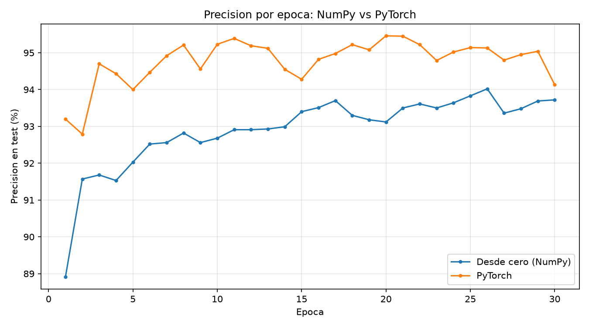
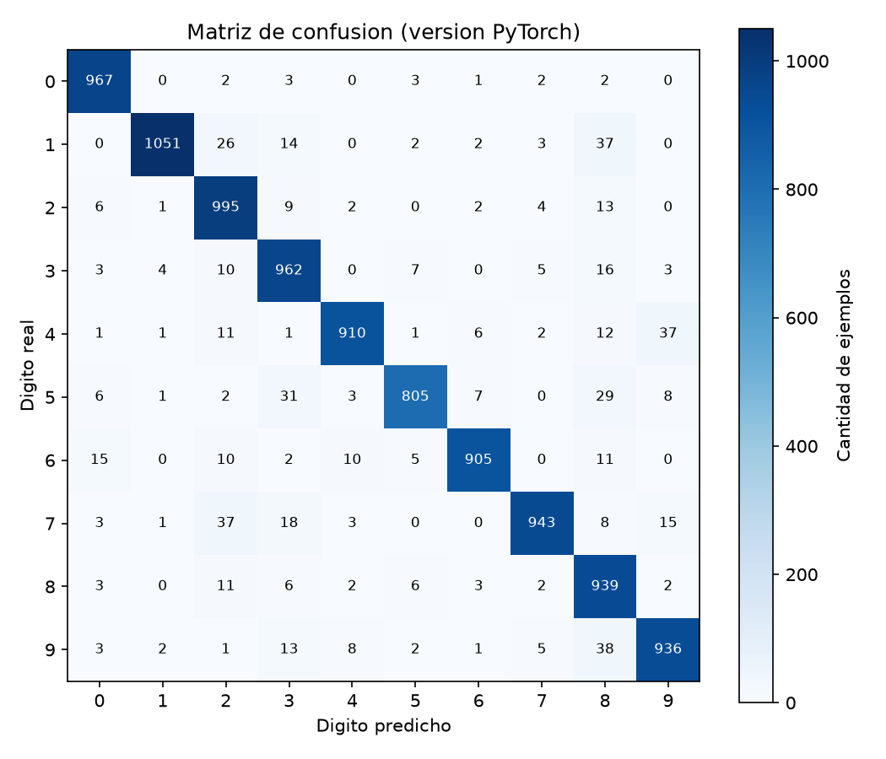
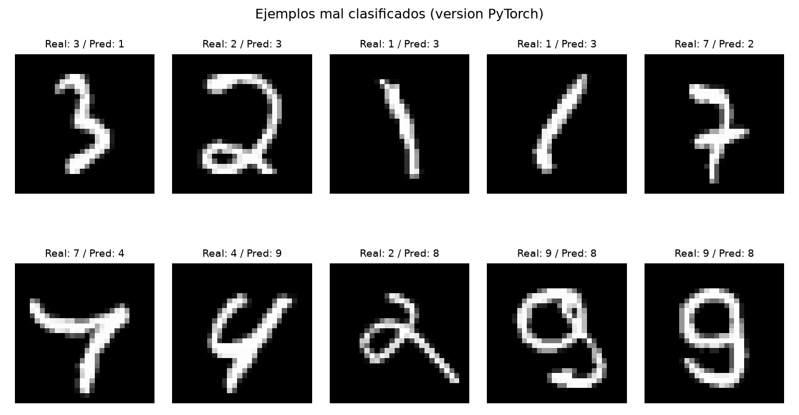

# Red Neuronal desde Cero: Reconocimiento de Dígitos (MNIST)
 
Implementación de una red neuronal feedforward que clasifica dígitos escritos a mano (0-9) del dataset MNIST, en dos versiones: una construida desde cero con NumPy puro (forward pass, backpropagation y descenso de gradiente estocástico implementados manualmente), y otra equivalente usando PyTorch, para comparar ambos enfoques.
 
Proyecto realizado siguiendo la serie [Neural Networks de 3Blue1Brown](https://www.youtube.com/playlist?list=PLZHQObOWTQDNU6R1_67000Dx_ZCJB-3pi) y el libro [Neural Networks and Deep Learning de Michael Nielsen](http://neuralnetworksanddeeplearning.com/).
 

 
## Tabla de contenidos
 
- [Resumen](#resumen)
- [Resultados](#resultados)
- [Fundamentos](#fundamentos)
- [Estructura del repositorio](#estructura-del-repositorio)
- [Instalación y uso](#instalación-y-uso)
- [NumPy vs PyTorch](#numpy-vs-pytorch-qué-reemplaza-a-qué)
- [Qué aprendí](#qué-aprendí)
- [Posibles extensiones](#posibles-extensiones)
- [Referencias y créditos](#referencias-y-créditos)
## Resumen
 
El problema es clásico y acotado: clasificar imágenes de 28x28 píxeles de dígitos escritos a mano en una de 10 categorías (0 al 9). La arquitectura es una red feedforward totalmente conectada:
 
```
Entrada: 784 neuronas (imagen de 28x28 aplanada)
Capa oculta 1: 16 neuronas
Capa oculta 2: 16 neuronas
Salida: 10 neuronas (una por dígito)
```
 
La versión desde cero llegó a **93.72%** de precisión en el set de test tras 30 épocas de entrenamiento. La versión con PyTorch, usando ReLU y CrossEntropyLoss en lugar de sigmoide y error cuadrático, llegó a **94.13%**.
 
## Resultados
 
### Matriz de confusión (versión PyTorch)
 

 
La red confunde con más frecuencia los pares que también son ambiguos para un ojo humano: 9 con 8, 4 con 9, 1 con 8, 7 con 2. Esto es una buena señal, sugiere que la red está aprendiendo patrones reales de forma de trazo y no memorizando ejemplos particulares.
 
### Ejemplos mal clasificados
 

 
Varios de estos errores son comprensibles incluso mirándolos directamente (trazos ambiguos, dígitos escritos de forma poco convencional).
 
Un análisis más detallado, con el desglose exacto de los pares más confundidos y las curvas de entrenamiento completas, está en [`notebooks/model_comparison.ipynb`](notebooks/model_comparison.ipynb).
 
## Fundamentos
 
Esta sección explica el razonamiento matemático detrás del código en `src/scratch/`, conectado directamente con la serie de videos.
 
### Arquitectura y forward pass
 
Cada neurona de una capa recibe como entrada las activaciones de todas las neuronas de la capa anterior, cada una multiplicada por un peso individual, más un bias propio de la neurona. El resultado pasa por una función de activación (sigmoide) que lo comprime al rango (0, 1):
 
```
a' = sigmoid(W · a + b)
```
 
`W` es la matriz de pesos entre dos capas consecutivas, `a` es el vector de activaciones de la capa anterior, y `b` es el vector de biases de la capa actual. Aplicar esta fórmula capa por capa, desde la entrada hasta la salida, es el "forward pass" (`Network.feedforward` en `network.py`). Con pesos inicializados al azar, esto produce predicciones sin ningún criterio, el aprendizaje ocurre después, ajustando `W` y `b`.
 
### Función de costo
 
Para saber qué tan mal está una predicción, se compara la salida de la red con la respuesta correcta usando una función de costo. Este proyecto usa el error cuadrático medio:
 
```
C = 1/2 * sum((activación - valor_correcto)^2)
```
 
Un costo alto significa que la red está lejos de la respuesta correcta. El objetivo del entrenamiento es encontrar los valores de `W` y `b` que minimizan este costo, en promedio, sobre todos los ejemplos de entrenamiento.
 
### Descenso de gradiente
 
El gradiente de la función de costo indica, para cada peso y cada bias, en qué dirección moverse para reducir el costo. Descenso de gradiente estocástico (SGD) significa que, en lugar de calcular el gradiente exacto sobre las 60,000 imágenes de entrenamiento a la vez (lento), se aproxima usando pequeños lotes de ejemplos (mini-batches), y se ajustan los pesos después de cada lote:
 
```
peso_nuevo = peso_viejo - learning_rate * gradiente
```
 
El `learning_rate` controla qué tan grande es cada paso de ajuste. Un valor muy alto hace que el entrenamiento "rebote" alrededor del mínimo sin asentarse (visible en las oscilaciones de la curva de precisión de arriba); uno muy bajo hace que el entrenamiento sea innecesariamente lento.
 
### Backpropagation
 
Backpropagation es el algoritmo que calcula ese gradiente de forma eficiente, usando la regla de la cadena. La idea central: el error de la capa de salida se puede calcular directamente comparando la predicción con la respuesta correcta, y el error de cada capa anterior se puede derivar a partir del error de la capa siguiente, ponderado por los pesos que las conectan. Esto permite propagar el error "hacia atrás", capa por capa, y calcular el gradiente de cada peso y bias de la red en una sola pasada. La implementación completa está en `Network.backprop`.
 
## Estructura del repositorio
 
```
mnist-neural-network/
├── README.md
├── requirements.txt
├── .gitignore
├── data/                        # MNIST descargado (no versionado)
├── src/
│   ├── scratch/                  # Implementación manual con NumPy
│   │   ├── mnist_loader.py
│   │   ├── network.py
│   │   └── train.py
│   ├── pytorch_version/          # Implementación con PyTorch
│   │   ├── model.py
│   │   └── train.py
│   └── utils/
│       └── visualize.py
├── notebooks/
│   └── model_comparison.ipynb    # Comparación completa, con gráficos
├── results/                       # Modelos entrenados y gráficos
└── tests/
```
 
## Instalación y uso
 
```bash
git clone https://github.com/alfonsoariztiac-stack/mnist-neural-network.git
cd mnist-neural-network
 
python3 -m venv venv
source venv/bin/activate        # En Windows: venv\Scripts\activate
pip install -r requirements.txt
```
 
Entrenar y evaluar ambas versiones:
 
```bash
# Entrenar la version desde cero (NumPy). Tarda entre 5 y 20 minutos.
python3 src/scratch/train.py
 
# Entrenar la version con PyTorch. Tarda entre 1 y 3 minutos.
python3 src/pytorch_version/train.py
 
# Generar los graficos de comparacion en results/
python3 src/utils/visualize.py
```
 
O abre directamente `notebooks/model_comparison.ipynb` en Jupyter o VS Code para ver el análisis completo (asume que ya corriste los dos scripts de entrenamiento, ya que lee los resultados guardados en `results/` en vez de reentrenar).
 
## NumPy vs PyTorch: qué reemplaza a qué
 
| Versión desde cero (NumPy) | Versión PyTorch | Qué hace |
|---|---|---|
| `np.random.randn(...)` para pesos y biases | `nn.Linear(784, 16)` | Inicializar pesos y biases de una capa |
| `feedforward()`, bucle manual capa por capa | Método `forward()` de `nn.Module` | Propagar una imagen a través de la red |
| `backprop()`, ~15 líneas derivando gradientes con la regla de la cadena | `loss.backward()` | Calcular el gradiente de cada peso y bias |
| `update_mini_batch()`, resta manual `learning_rate * gradiente` | `optimizer.step()` | Ajustar los pesos según el gradiente |
| Slicing manual (`data[k:k+batch_size]`) | `DataLoader(dataset, batch_size=10, shuffle=True)` | Armar y mezclar mini-lotes |
 
Ambas versiones implementan el mismo algoritmo. La diferencia de precisión entre ellas (PyTorch ligeramente por encima) no viene de que PyTorch sea "mejor", sino de dos decisiones de diseño: ReLU en lugar de sigmoide en las capas ocultas, y CrossEntropyLoss en lugar de error cuadrático medio, ambas elecciones estándar en la industria hoy en día.
 
## Qué aprendí
 
Armar la versión desde cero fue la parte que más me costó entender de verdad, sobre todo la intuición de por qué el error se "reparte hacia atrás" ponderado por los pesos en backpropagation. Ver que la implementación en NumPy y la de PyTorch llegan a resultados similares (con la misma lógica de fondo, solo automatizada) terminó de confirmar que entendía el mecanismo y no solo estaba copiando fórmulas.
 
El proceso también incluyó su cuota de debugging real: un bug de rutas relativas que hizo perder un entrenamiento completo, un archivo mal excluido en `.gitignore`, y algún commit fuera de orden. Los dejé documentados en el historial de commits del repositorio en lugar de squashearlos, porque ese proceso de encontrar y corregir errores es tan parte de aprender esto como el código que finalmente funcionó.
 
## Posibles extensiones
 
- Learning rate decay: reducir el learning rate a medida que avanza el entrenamiento, para que los pasos sean grandes al principio y finos al final.
- Regularización (dropout o L2) para reducir overfitting en arquitecturas más grandes.
- Una red convolucional (CNN), el siguiente paso natural para visión por computador, que explota la estructura espacial de la imagen en lugar de tratarla como un vector plano de 784 números.
## Referencias y créditos
 
- [3Blue1Brown, Neural Networks (playlist)](https://www.youtube.com/playlist?list=PLZHQObOWTQDNU6R1_67000Dx_ZCJB-3pi)
- Michael Nielsen, [Neural Networks and Deep Learning](http://neuralnetworksanddeeplearning.com/), y su [código de referencia](https://github.com/mnielsen/neural-networks-and-deep-learning)
- Yann LeCun et al., [MNIST database](http://yann.lecun.com/exdb/mnist/)
## Licencia
 
MIT
