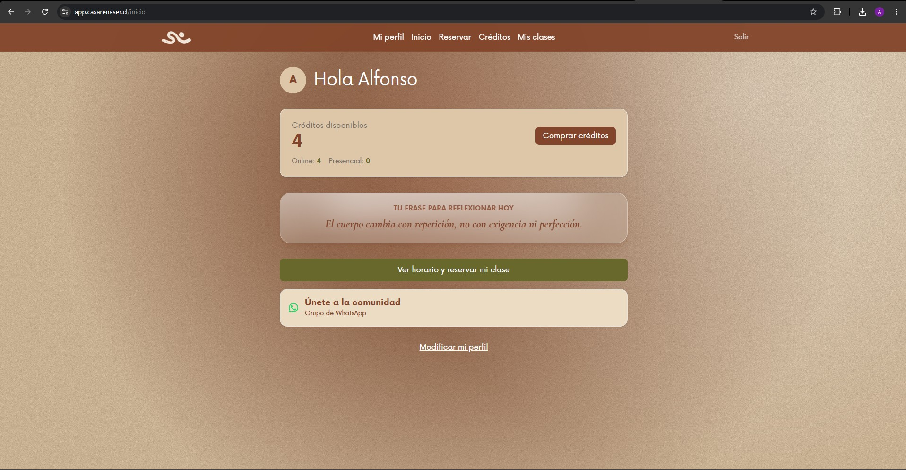
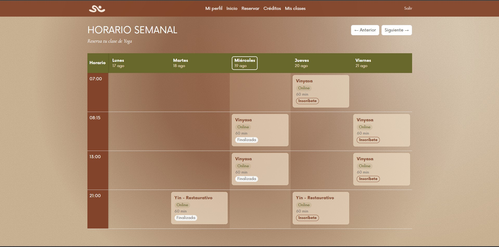
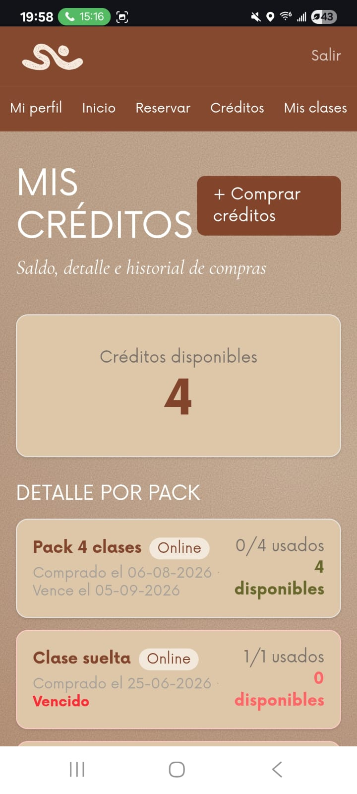
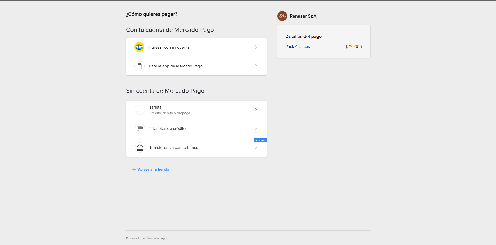
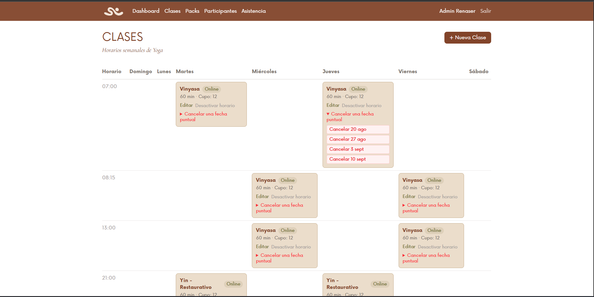

# App Renaser

PWA de gestión para **Casa Renaser**, un estudio de yoga y eventos en Chile. Reemplaza el agendamiento manual por WhatsApp y planillas con un sistema propio de reservas, pagos y administración. En producción: [app.casarenaser.cl](https://app.casarenaser.cl)

## El problema

El estudio operaba con WhatsApp y planillas para gestionar cupos, pagos y asistencia. Era un proceso manual, con errores frecuentes (incertidumbre de la fecha de vencimiento de los créditos, pagos difíciles de rastrear, difícil coordinación de clases y cancelaciones) y sin ninguna visibilidad centralizada para la administradora.

## La solución

Una aplicación web instalable (PWA) con dos frentes.

**Para las participantes:** compran un *pack* (por ejemplo, "4 clases al mes"), que carga *créditos* a su cuenta. Cada reserva de clase consume 1 crédito. Si cancelan con al menos 1 hora de anticipación, el crédito se reintegra automáticamente. Los créditos expiran a los 30 días. El pago es vía Mercado Pago (Checkout Pro) o transferencia manual confirmada por la administradora. Hay notificaciones push para recordatorios de clase y confirmaciones de pago.

**Para la administradora:** un panel en `/admin` con dashboard de ocupación diaria, CRUD de clases y packs, gestión de participantes (saldo de créditos, asignación de packs), confirmación manual de pagos, marcado de asistencia, y reportes exportables (CSV/Excel) de asistencia e ingresos.

Las clases se definen como horarios recurrentes (por ejemplo, "Vinyasa, lunes 19:00"). Un job semanal genera automáticamente las ocurrencias concretas 90 días hacia adelante, así que la administradora nunca gestiona fechas una por una.

Es instalable como PWA (manifest + service worker, funciona como app nativa desde la pantalla de inicio). El siguiente paso ya está en construcción: un empaquetado nativo para iOS con Capacitor, para publicarla en la App Store.

## Stack técnico

- **Frontend/Backend:** Next.js 16 (App Router, Turbopack) + React 19, Tailwind CSS v4
- **Base de datos:** PostgreSQL (Supabase) + Prisma 6, con 11 tablas que cubren usuarios, packs, compras, clases, ocurrencias, reservas y consumo de créditos
- **Auth:** NextAuth v5 (credenciales + Google OAuth)
- **Pagos:** Mercado Pago Checkout Pro (webhook IPN) + confirmación manual para transferencias
- **Notificaciones push:** Web Push API
- **Correo:** Resend (recuperación de contraseña)
- **PWA:** instalable, con service worker y caché offline
- **CI/CD:** GitHub Actions (lint, test, build), tests con Vitest
- **Hosting:** Railway, DNS vía Cloudflare

## Mi rol

Desarrollo fullstack con Claude Code como herramienta principal de desarrollo. Diseño de la arquitectura y las reglas de negocio (créditos, reservas, expiración), orientación de cada sprint de desarrollo, revisión y corrección del código y las funcionalidades que se generan, integración de los servicios externos (pagos, auth, notificaciones, correo) y validación de los flujos completos antes de dar por cerrada cada iteración. El despliegue y el CI/CD también los armé yo.

## Estado

En producción y en desarrollo activo, con iteraciones continuas desde junio de 2026.

---

*Código fuente privado por acuerdo con el cliente. Este documento describe el proyecto sin exponerlo.*
