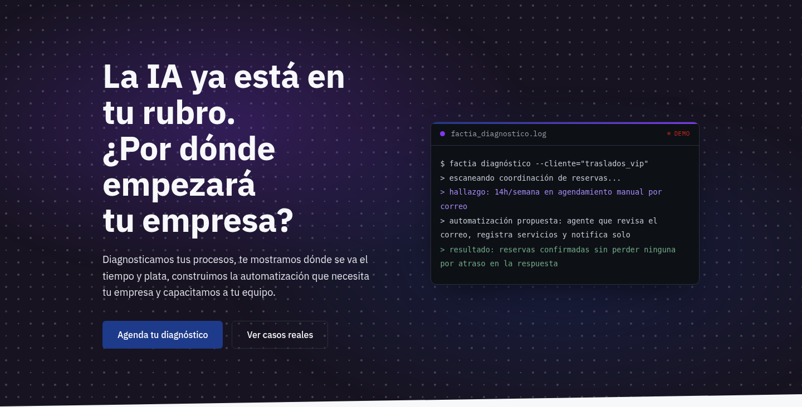
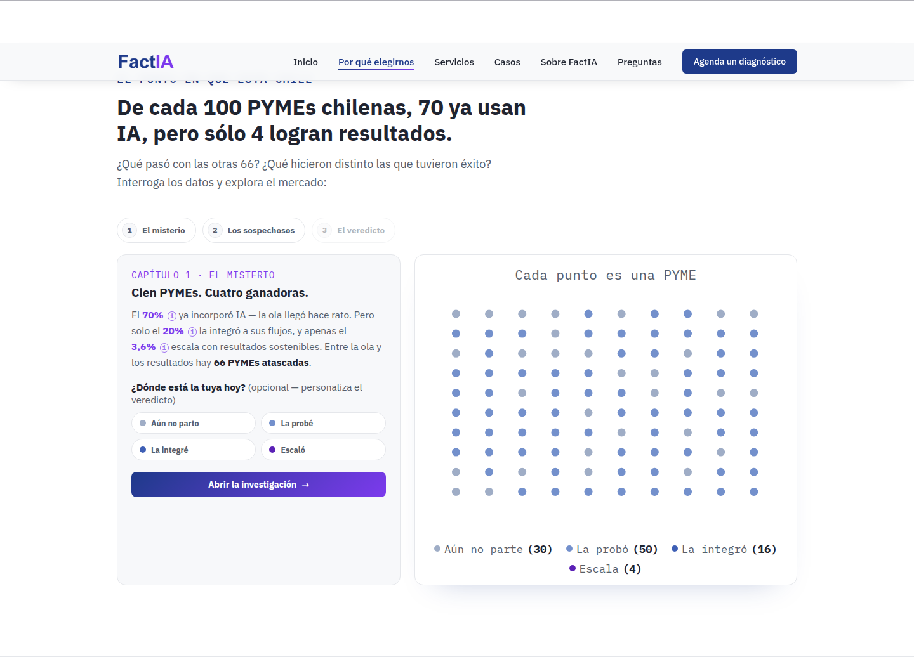
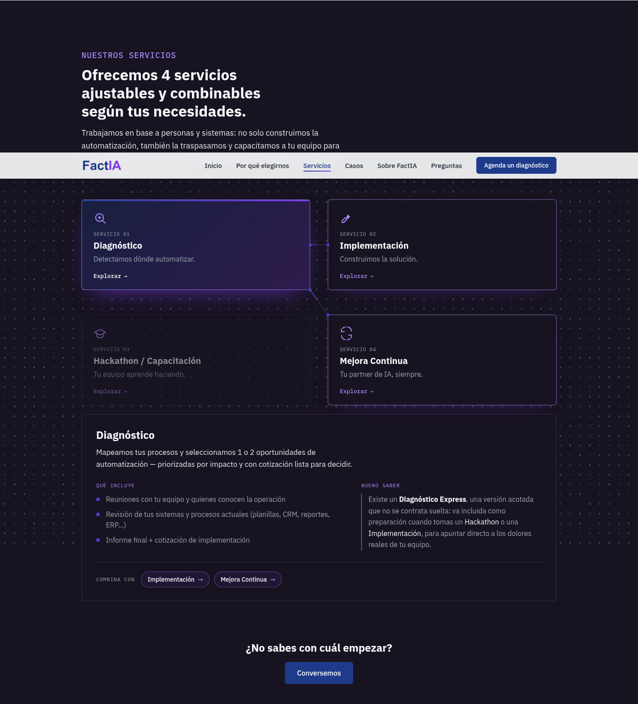

# Web FactIA

Landing page de **FactIA**, mi propia consultora de automatización e IA para PYMEs chilenas. En producción: [factia.cl](https://factia.cl)

## El problema

FactIA tenía capacidad de entrega probada (proyectos como Transrai Agent y App Renaser ya en marcha) pero ninguna imagen profesional hacia afuera. Sin una web, cada conversación de venta arrancaba de cero explicando qué hace la empresa, y no había ningún lugar donde un prospecto pudiera evaluar la oferta por su cuenta antes de una reunión.

## La solución

Una landing de una sola página, sin framework ni build step, pensada para que un dueño de PYME entienda en minutos qué problema resuelve FactIA y por qué.

El punto más elaborado es la sección "El caso de las 100 PYMEs": un escenario de datos interactivo en 3 capítulos (el misterio, los sospechosos, el veredicto) que arma el argumento de venta con cifras reales de adopción de IA en Chile, en vez de un texto plano. El usuario puede marcar en qué etapa está su propia empresa y el veredicto final se ajusta a esa elección. Si JavaScript o el motor de gráficos no cargan, un fallback estático con las mismas cifras en texto queda visible igual: la sección nunca se rompe.

Más abajo, un configurador de servicios deja explorar los 4 servicios de FactIA (Diagnóstico, Implementación, Hackathon/Capacitación, Mejora Continua) como tarjetas conectadas, cada una con su propio detalle de qué incluye y con qué otro servicio combina. El resto de la página cubre casos de éxito, presentación del equipo, preguntas frecuentes y un formulario de contacto.

El formulario no tiene backend propio: el submit pega directo a un Google Apps Script que escribe la fila en un Google Sheet y dispara una notificación por correo. Incluye honeypot anti-spam y sanitización contra inyección de fórmulas en las respuestas.

## Stack técnico

- **Frontend:** HTML/CSS/JS sin framework, sin build step
- **Visualización de datos:** Apache ECharts 6.1.0, vendorizado en el propio repo (sin CDN, sin dependencia externa en runtime)
- **Formulario:** Google Apps Script + Google Sheets, sin backend propio
- **Hosting:** Cloudflare Workers, deploy manual vía Wrangler
- **Dominio:** factia.cl (NIC Chile), DNS en Cloudflare

## Mi rol

Diseño y desarrollo completo con Claude Code como herramienta principal: copy y estructura de la propuesta de valor, diseño del escenario interactivo de datos, el configurador de servicios, y toda la infraestructura de deploy y formulario.

## Estado

En producción en factia.cl, con iteraciones activas desde julio de 2026.
